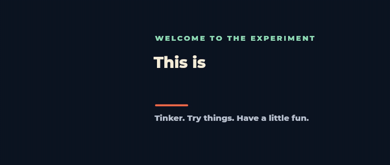
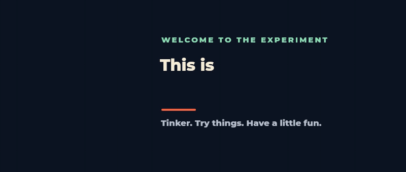

# Jev Workbench welcome animations

Both variants are six-second, 800 × 340, 25 fps loops with animated eyes,
eye contact, a final wink, and the mint star. The character has no icon tile.

## 1. Stumble, then wink

Two uneven landing steps, a balance recovery, then the greeting.

[GIF](assets/jev-welcome-stumble.gif) · [Video](assets/jev-welcome-stumble.mp4) · [Still](assets/jev-welcome-stumble.png)

Editable source: `scripts/jev-welcome-stumble.jsx`.

## 2. Spin into place, then wink

A continuous spinning arrival, a gentle settle, then the greeting.

[GIF](assets/jev-welcome-spin.gif) · [Video](assets/jev-welcome-spin.mp4) · [Still](assets/jev-welcome-spin.png)

Editable source: `scripts/jev-welcome-spin.jsx`.

The earlier combined stumble-and-spin animation remains in `assets/jev-welcome.gif`.
The original approved wink version is preserved in `assets/versions/wink-v1/`.
