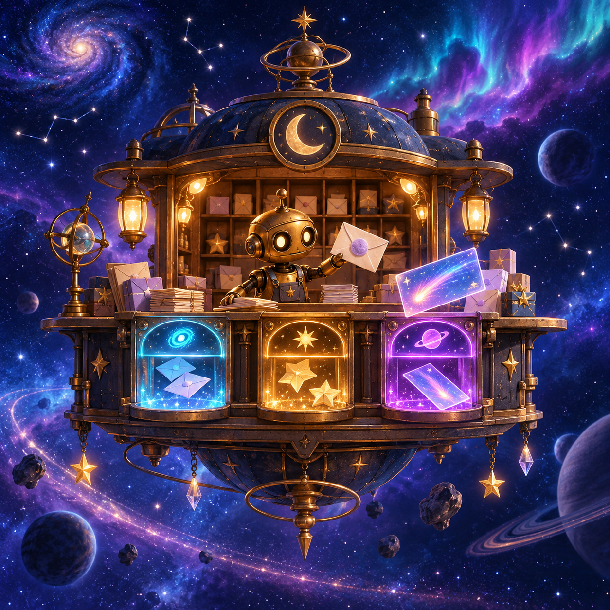

# The Astral Post Office

Nix Quill is the smallest postkeeper in the Aurora Route and the only one awake
when the night mail falls. Nix's job is wonderfully specific: keep messages
moving between people who live too far apart to shout.

Tonight, the Address Eater arrives early. It is not cruel exactly; it is a
cosmic fog that loves unfinished routes. It has blurred destinations, given one
parcel two moons at once, and left a bottle note with only a mysterious phrase.
The consequence is friendly but real: if the five letters are mishandled, the
route will drift until morning.

The opening moment is one bright tray, five jewel-like pieces of mail, and one
question: what can Nix do responsibly with only the facts in front of them?

## Story arc

1. **The falling mail.** Nix catches five letters before they disappear into the
   cloud belt. The player meets the rulebook through the smallest possible
   choices: deliver, hold, or return.
2. **The fog gets clever.** The cards teach the difference between missing
   information and conflicting information. A blank recipient is not the same
   thing as two impossible destinations.
3. **The route lights up.** Each grounded decision restores one glowing segment
   of the Aurora Route. The last lesson is that holding for a clue is an active,
   responsible action, not a failure to decide.

## Why it is the connector opener

This world has a visible handoff. An assistant reads a compact, charming case;
it returns an exact set of decisions; Workbench presents that proposal without
making the person hunt for it; and the local fixture verifies the decision set
only after approval. The result is a story outcome everyone can understand:
Nix either restored the route or knows exactly which letter needs another clue.

The cover art should feel like the case has a little home in the product: blue
space, warm brass, translucent colored mail slots, and a small point of view
character who makes the workflow feel welcoming.
