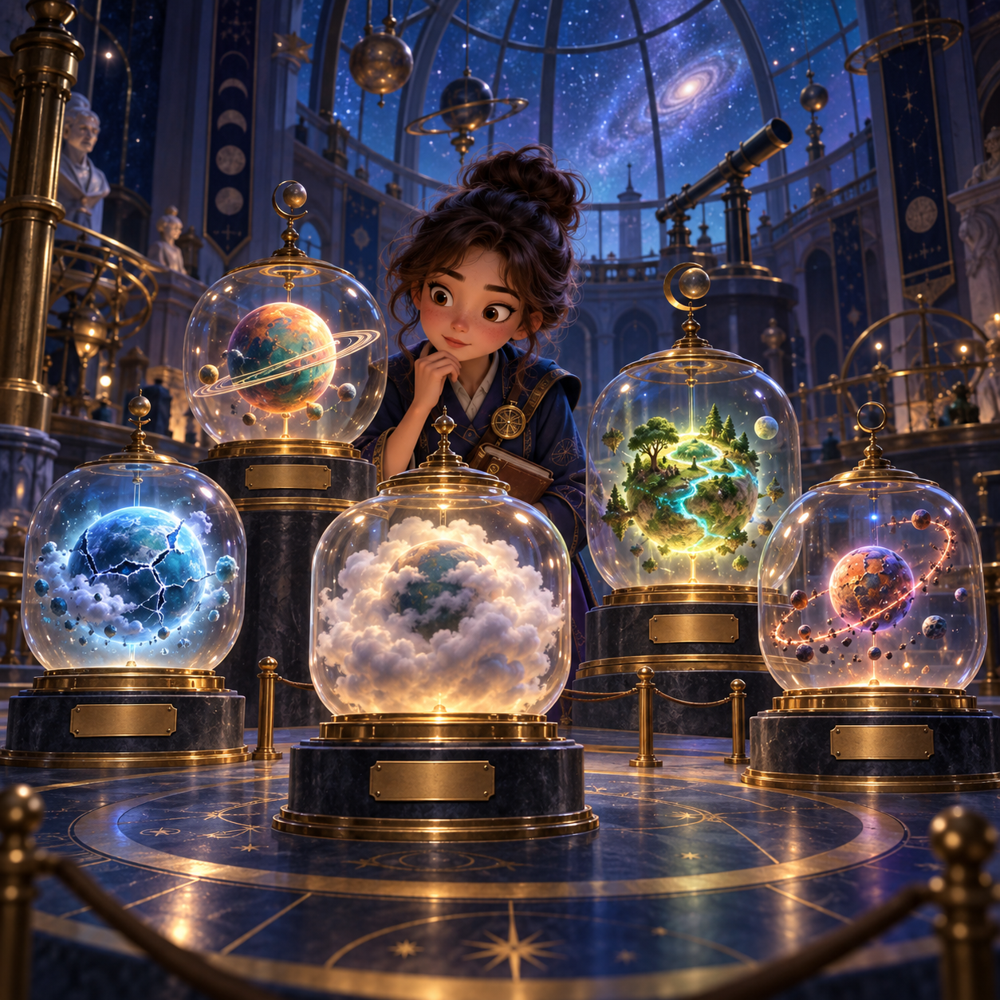

# The Museum of Tiny Planets

Mio Vesper is an apprentice curator at a museum so large it has an observatory
for a roof. Their favorite room is the smallest one: the cabinet of tiny
planets, each world no bigger than a lantern and no less deserving of a truthful
label.

The museum has a quiet antagonist called the Drift. It appears whenever someone
tries to solve a missing fact with a confident story. The Drift does not smash
the glass. It makes the planets lose their bearings, one shy moon at a time.

## Story arc

1. **The meteor-shower delivery.** Five cases arrive without enough room in the
   exhibition to make a careless guess. The terminal begins as Mio's ledger:
   one input, one typed placement, one reason grounded in a fact.
2. **The temptation to make it prettier.** The Whisper Globe is beautiful and
   mysterious, but beauty is not an origin. The Sleeper Pebble has a story
   waiting to happen, but it does not have an observed orbit.
3. **The exhibition opens honestly.** The stable worlds glow in the Orbitarium,
   the hurt world goes to the Repair Bench, and the unknown worlds sit beneath
   the Observatory until somebody can learn more.

## Why it is terminal-first

The Museum is designed to prove that a terminal can feel like a friendly
instrument rather than a punishment. It is a clean JSON-in, decisions-out
fixture with readable names, tiny icons, and precise validation. The image and
story make it inviting; the facts remain compact enough to inspect in a single
terminal screen.

The terminal outcome should say which specimen passed and why. It should never
hide an uncertain item behind a generic success badge.
